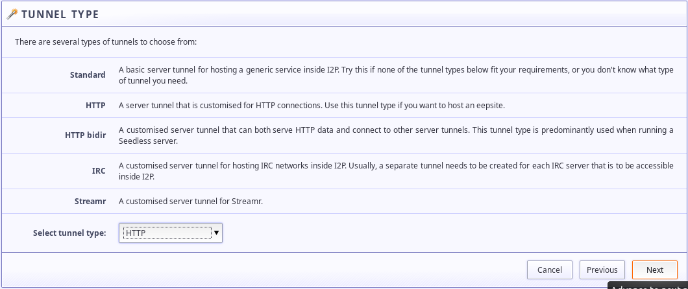

i2p-apt-cacher-ng
-----------------

OK it's usable now. Make sure to read the full instructions.

This project makes use of the I2P network. In order to use it, you will need to
get an i2p router. [There is the original Java version](https://geti2p.net) and
a [C++ version](https://i2pd.website).

apt-installable configuration of apt-cacher-ng set up to help provide and
install i2p software currently available from the clearnet, or at least that's
the plan. It won't be "done" for at least another two months, because it needs
split configs. It also requires genmkfile.

Although I'm exploring use of a proxy between apt-cacher-ng and the upstream
repositories to obscure the location of the requester, I haven't confirmed that
such a thing works yet. As such, this is currently geared toward *non-anonymous*
organizations that want to provide access to certain Debian-like repositories
over i2p, or organizations with sufficient expertise and resources to obfuscate
their location and identity in other ways(Such as by using Tor to retrieve
packages between apt-cacher-ng and deb.debian.org or by using a local mirror
acquired in any of probably hundreds of other ways potentially).

To be clear:

        apt ---  anonymous --> apt-cacher-ng --- clearnet --> debian
        apt <--  anonymous --- apt-cacher-ng <-- clearnet --- debian

in this scenario, apt is hidden, apt-cacher-ng is not.

### Settings I've pre-configured

 * Binds to localhost only, uses alternate port(7342) and alternate directory
 for i2p-specific configuration and package cache
 * Removed defaults that automatically cache all Debian packages. Instead it
 should just cache packages from i2p-specific repositories and pass-through the
 rest
 * Sets own defaults, uses own initscript, has own systemd unit file, own PID.
 * Still runs as user apt-cacher-ng
 * Allows CONNECT to a LOT of sites: This is the expression in the PassThroughPattern field.

        (ppa\.launchpad\.net|deb\.i2p2\.de|repo\.i2pd\.xyz|debian\.unnoba\.edu\.ar|mirror\.aarnet\.edu\.au|debian\.anexia\.at|ftp\.tu-graz\.ac\.at|mirror\.internex\.at|mirror\.datacenter\.by|ftp\.belnet\.be|mirror\.as35701\.net|repositorio\.nti\.ufal\.br|debian\.ludost\.net|ftp\.uni-sofia\.bg|debian\.ca-west\.mirror\.fullhost\.com|mirror\.csclub\.uwaterloo\.ca|mirrors\.163\.com|mirrors\.tuna\.tsinghua\.edu\.cn|mirrors\.ustc\.edu\.cn|mirrors\.ucr\.ac\.cr|ftp\.debian\.cz|ftp\.sh\.cvut\.cz|ftp\.zcu\.cz|merlin\.fit\.vutbr\.cz|mirror\.dkm\.cz|mirror\.one\.com|mirrors\.dotsrc\.org|debian\.ues\.edu\.sv|ftp\.eenet\.ee|debian\.mirror\.ate\.info|ftp\.u-strasbg\.fr|mirror\.plusserver\.comdebian|mirrors\.ircam\.fr|debian\.grena\.ge|artfiles\.org|debian\.charite\.de|debian\.inf\.tu-dresden\.de|debian\.tu-bs\.de|ftp\.fau\.de|ftp\.halifax\.rwth-aachen\.de|ftp\.mpi-sb\.mpg\.de|ftp\.plusline\.net|ftp-stud\.hs-esslingen\.de|ftp\.tu-chemnitz\.de|mirror\.eu\.oneandone\.net|mirror\.netcologne\.de|mirror\.wtnet\.de|packages\.hs-regensburg\.de|mirror\.xtom\.com\.hk|ftp\.fsn\.hu|debian\.simnet\.is|mirror\.isoc\.org\.il|debian\.mirror\.garr\.it|ftp\.linux\.it|dennou-k\.gfd-dennou\.org|dennou-q\.gfd-dennou\.org|ftp\.jaist\.ac\.jp|ftp\.yz\.yamagata-u\.ac\.jp|mirror\.hoster\.kz|mirror\.ps\.kz|debian\.mirror\.liquidtelecom\.com|ftp\.harukasan\.org|ftp\.lanet\.kr|debian\.koyanet\.lv|mirror\.litnet\.lt|debmirror\.tuxis\.nl|ftp\.nluug\.nl|mirror\.i3d\.net|mirror\.neostrada\.nl|mirror\.nforce\.com|mirror\.nl\.datapacket\.com|mirror\.novg\.net|mirror\.serverius\.net|mirror\.vpgrp\.io|mirror\.fsmg\.org\.nz|mirror\.pregi\.net|ftp\.icm\.edu\.pl|ftp\.eq\.uc\.pt|ftp\.rnl\.tecnico\.ulisboa\.pt|mirrors\.up\.pt|mirrors\.nav\.ro|mirrors\.nxthost\.com|mirrors\.pidginhost\.com|ftp\.psn\.ru|mirror\.corbina\.net|mirror\.0x\.sg|ftp\.arnes\.si|debian\.redimadrid\.es|debian\.redparra\.com|ftp\.caliu\.cat|ftp\.cica\.es|ftp\.acc\.umu\.se|mirror\.linux\.pizza|mirror\.zetup\.net|debian\.ethz\.ch|mirror\.init7\.net|mirror\.iway\.ch|mirror\.sinavps\.ch|pkg\.adfinis-sygroup\.ch|debian\.csie\.ntu\.edu\.tw|ftp\.ntou\.edu\.tw|mirror\.applebred\.net|mirror\.kku\.ac\.th|ftp\.metu\.edu\.tr|debian\.volia\.net|debian\.mirror\.uk\.sargasso\.net|mirror\.bytemark\.co\.uk|mirror\.mythic-beasts\.com|mirror\.sax\.uk\.as61049\.net|mirrorservice\.org|ftp\.debian\.org|mirror\.sucs\.swan\.ac\.uk|mirror\.vorboss\.net|debian\.osuosl\.org|mirror\.hmc\.edu|mirror\.math\.princeton\.edu|mirrors\.bloomu\.edu|mirrors\.cat\.pdx\.edu|mirrors\.edge\.kernel\.org|mirrors\.gigenet\.com|mirror\.sjc02\.svwh\.net|mirrors\.lug\.mtu\.edu|mirrors\.namecheap\.com|mirrors\.ocf\.berkeley\.edu|mirrors\.syringanetworks\.net|mirror\.steadfast\.net|mirrors\.wikimedia\.org|mirrors\.xmission\.com|repo\.cure\.edu\.uy):443

  - It passes through every HTTPS-enabled Debian mirror I could find. This makes
  it useful as an in-proxy for official Debian packages.
 * i2pd tunnels.d file
 * Where necessary, logging *will be* disabled by default

I need to customize the homepage and the reports page still.

Client Setup:
-------------

### ad-hoc with apt-transport-i2p or apt-transport-i2phttp

First, install [apt-transport-i2phttp](https://github.com/eyedeekay/apt-transport-i2phttp)
or [apt-transport-i2p](https://github.com/eyedeekay/apt-transport-i2p). Either
will work, but apt-transport-i2phttp is slightly easier to configure, as it
requires no configuration of the i2p router.

Once you've installed an apt-transport for i2p, add something like this to your
/etc/apt/sources.list.d with the available repositories you wish to retrieve
over i2p.

        deb http://thisisanexampleofafiftytwocharacterstringbecauseits.b32.i2p/ppa.launchpad.net/i2p-maintainers/i2p/ubuntu bionic main
        deb-src http://thisisanexampleofafiftytwocharacterstringbecauseits.b32.i2p/ppa.launchpad.net/i2p-maintainers/i2p/ubuntu bionic main

### system-wide with a dedicated tunnel

This behaves more like apt-cacher-ng does on a LAN once the tunnel is
configured, but it also requires that the apt-cacher-ng instance be able to
retrieve all the packages you want, as apt will attempt to use the proxy to
retrieve all the packages instead of just the ones you specified to run over
i2p.

Detailed configuration will be posted shortly.

Service Setup: I2P
------------------

With a few exceptions, Debian package sources are just HTTP/S servers. All it
takes is to point an HTTP Server tunnel at the locally running service. Launch
the Tunnel Wizard and configure a tunnel with the following settings:

1. Select a server tunnel

2. Select an HTTP service

3. Name it something memorable

4. Direct it at the i2p-apt-cacher-ng port(127.0.0.1:7342)

5. Set it to start up automatically with the router

6. Make sure your settings resemble this:

### Optimizations:

Since the connection between the proxy and the actual Debian repositories is not
anonymized yet, there isn't much point in having long, highly anonymous tunnels.
You may wish to reduce the length of the tunnels to speed up retrieval.

Service Setup: i2pd
-------------------

On versions of i2pd after 2.21 it should "just work." It does use Debian's
configuration directory(/etc/i2pd/tunnels.d) as opposed to the default i2pd
configuration directory (/var/lib/i2pd/tunnels.d), so if you're using something
that is not Debian-like, you will need to symlink it to the correct directory.

If you're still running 2.20 or lower, upgrade. There's lots of cool stuff in
the new versions. If you absolutely cannot upgrade for some reason, add this to
your tunnels.conf file:

        [APT-INBOUND]
        type = server
        host = 127.0.0.1
        port = 7342
        inbound.length = 1
        outbound.length = 1
        inbound.quantity = 1
        outbound.quantity = 1
        inbound.backupQuantity = 1
        outbound.backupQuanitity = 1
        keys = apt-cacher-ng-in.dat

Service Setup: sam-forwarder(router-agnostic)
---------------------------------------------

#### Links/Sources:

 * https://blog.packagecloud.io/eng/2015/05/05/using-apt-cacher-ng-with-ssl-tls/
 * https://www.zyxware.com/articles/3733/how-to-change-the-directory-of-the-apt-cacher-ng-downloaded-packages
 * https://www.unix-ag.uni-kl.de/~bloch/acng/html/howtos.html#mirroring
 * https://fabianlee.org/2018/02/11/ubuntu-a-centralized-apt-package-cache-using-apt-cacher-ng/
 * https://wiki.debian.org/AptCacherNg
